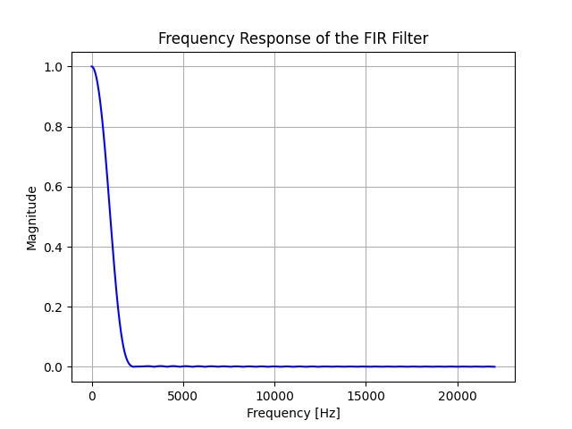
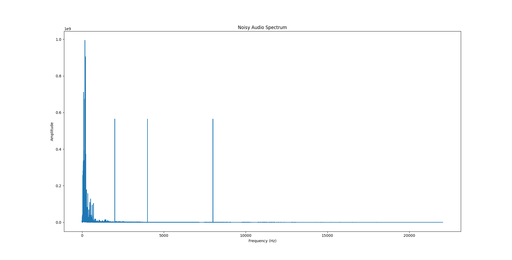

## VHDL Nexus Challenge: Low-pass FIR Filter for Audio Signal Processing

### Introduction

Audio signal processing is a fundamental aspect of electronic engineering, with wide-ranging applications from music production to communications. In simple terms, it deals with the manipulation of audio signals to achieve a desired outcome, be it filtering unwanted frequencies, amplifying specific components, or even transforming one type of signal into another.

A common scenario in real-world applications involves dealing with unwanted noise. Often, external interference or device limitations introduce high-frequency noise components that can be distracting or even detrimental to the desired signal quality. A **low-pass filter** (LPF) is specifically designed to attenuate these undesired high-frequency components, allowing only the lower frequencies to pass through.

For this challenge, our focus is on the **FIR (Finite Impulse Response)** filter topology. Given an audio file which has been corrupted with high-frequency noise, your task is to design a VHDL module that can restore the audio to its near-original quality by filtering out the unwanted high frequencies. To aid in this, the audio is primarily focused on bass frequencies, and the task is to filter out frequencies above 1kHz.

### Challenge Details

* **Audio Signal**: The audio signal to be processed is a 16-bit word representing the amplitude of the audio sample. The audio to be filter is `noisy_output.wav`

* **Filter Type**: The filter topology to be used for this challenge is FIR. A good starting point would be a 64-tap FIR filter. The weights for the filter can be generated using various methodologies, but for starters, you can use the provided Python script which employs the windowing method `FIR-generate.py`. Try to figure out by yourself the best way to quantize its valuers. Its pulse response is:


* **Noise**: The sample audio has been adulterated with noise primarily in the higher frequency range in 2kHz, 4kHz and 8kHz. Your filter should effectively reduce or eliminate this noise.

### Sample Visualization

Below are visual representations of the audio spectrum before and after the addition of high-frequency noise:

**Original Audio (without noise)**


**Noisy Audio**


### Source and Acknowledgement

The sample song for this challenge was sourced from [Freesound](https://freesound.org/).

## Prerequisites

### Python Packages

To run the script, ensure you have the required Python libraries installed:

```bash
pip install pydub numpy
```

### FFmpeg

The `pydub` library relies on `ffmpeg` for audio format conversions. Ensure you have `ffmpeg` installed and available in your system's PATH.

#### Installing FFmpeg:

- **Windows**: 
  1. Download a static build from [here](https://ffmpeg.zeranoe.com/builds/).
  2. Unzip it.
  3. Add the `bin` directory to your system's PATH.

- **macOS** (using Homebrew): 
  ```bash
  brew install ffmpeg
  ```

- **Linux** (e.g., Ubuntu):
  ```bash
  sudo apt update
  sudo apt install ffmpeg
  ```

---

Once you have both the Python packages and FFmpeg installed, you can proceed to run the script.

Note: The script processes audio files and might take a significant amount of time, especially for longer audio tracks. Ensure the input file "free_noise_input_file.wav" is present in the same directory as the script, or adjust the filepath accordingly. The noisy audio will be saved as "noisy_output.wav".